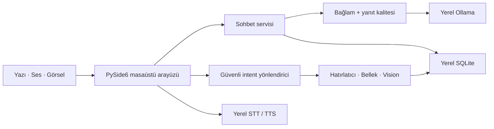

<p align="center">
  
</p>

<h1 align="center">Lina</h1>

<p align="center">
  <strong>Windows için sade, yerel ve gizlilik odaklı yapay zekâ asistanı.</strong>
</p>

<p align="center">
  
  
  
  
</p>

Lina; doğal Türkçe sohbeti, yerel ses işlemeyi, kalıcı sohbet geçmişini,
hatırlatıcıları ve görsel anlamayı tek bir PySide6 masaüstü uygulamasında
birleştirir. Ana deneyim sohbet alanıdır: ileri seviye otomasyon yüzeyleri varsayılan
olarak kapalı ve ana akışın dışındadır.

> [!IMPORTANT]
> Lina aktif geliştirilen bir **alpha** sürümdür. Birincil hedef Windows masaüstüdür;
> arayüz ve veri sözleşmeleri kararlı sürümden önce değişebilir.

## Temel özellikler

- **Yerel sohbet:** Metin yanıtları cihazdaki Ollama modeliyle üretilir.
- **Doğal Türkçe:** Yanıt dili, ilgililik, bozuk kelime ve prompt sızıntısı
  kontrollerinden geçer; gerekirse en fazla bir onarım denenir.
- **Kalıcı sohbetler:** Oturumlar SQLite'a kaydedilir; aranabilir, sabitlenebilir,
  arşivlenebilir ve yeniden adlandırılabilir.
- **Sesli kullanım:** Push-to-talk, yerel `faster-whisper` STT ve isteğe bağlı Windows
  TTS bulunur. Hands-free ve wake word ayrıca etkinleştirilir.
- **Doğal dille hatırlatıcı:** Tarih, saat ve tekrar bilgisi sohbetten anlaşılır;
  eksik bilgi sorulur ve kayıttan önce kısa onay alınır.
- **Ekran ve kamera:** Dosya, ekran, seçili bölge veya kullanıcı onaylı kamera
  karesi yerel vision modeliyle incelenir.
- **Temiz masaüstü arayüzü:** Sol tarafta sohbetler, ortada konuşma ve altta sade
  composer bulunur. Sağ ayrıntı paneli yalnız istendiğinde açılır.

## Nasıl çalışır?



Model, intent veya araç tek başına kalıcı işlem yapamaz. Hatırlatıcı ve bellek
yazma gibi işlemler typed doğrulamadan geçer ve kullanıcı onayı ister. Kamera ve ekran
erişimi de açık bir kullanıcı eylemiyle başlar.

## Gereksinimler

- Windows 10 veya daha yeni bir sürüm
- Python `3.11+`
- Kurulu ve çalışan [Ollama](https://ollama.com/)
- Sesli kullanım için mikrofon ve Windows mikrofon izni
- Vision için uyumlu yerel model ve yeterli RAM/VRAM

Varsayılan modeller:

- Metin: `llama3.2:3b`
- Vision: `qwen3-vl:2b`
- STT: `faster-whisper` `base`

## Kurulum

```powershell
git clone https://github.com/ilhanki/Lina.git
cd Lina

python -m venv .venv
.\.venv\Scripts\Activate.ps1
python -m pip install --upgrade pip
python -m pip install -r requirements.txt

ollama pull llama3.2:3b
ollama pull qwen3-vl:2b
```

Yalnız metin sohbeti kullanılacaksa vision modelini indirmek gerekmez.

Masaüstü uygulamasını başlatmak için:

```powershell
python gui.py
```

Terminal arayüzü için:

```powershell
python main.py
```

## Kullanım

Lina'nın temel işlevleri doğrudan sohbetten kullanılır:

```text
Bugün için kısa bir çalışma planı hazırlar mısın?

Yarın saat 9'da antrenmanım var, hatırlatır mısın?
Akşam 8'de annemi aramamı hatırlat.
Her pazartesi sabah 10'da toplantıyı hatırlat.

Ekranda ne görüyorsun?
Bu ekrandaki yazıyı özetle.
Kamerayı aç, elimde ne var söyle.

Şunu hatırla: kısa ve doğrudan cevapları tercih ediyorum.
Benim hakkımda ne hatırlıyorsun?
```

Bir hatırlatıcının tarihi, saati veya başlığı eksikse Lina yalnızca eksik bilgiyi
sorar. `iptal`, `vazgeç`, `boşver` ve `gerek yok` açık işlemi kapatır.

### Ses

Composer'daki **Mikrofon** düğmesi tek bir konuşmayı yazıya çevirir. Ayarlardan:

- transkripsiyonu composer'a ekleme veya doğrudan gönderme,
- mikrofon aygıtı ve hassasiyet,
- yerel sesli yanıt,
- barge-in, hands-free ve "Hey Lina" wake word

yapılandırılabilir. Ham mikrofon kaydı diske yazılmaz. Hands-free ve wake word
varsayılan olarak kapalıdır.

### Ekran, dosya ve kamera

- **Dosya** ile desteklenen yerel belge veya görsel seçilir.
- **Ekran** ile tüm ekran ya da seçili bölge geçici bağlam olarak eklenir.
- Kamera doğal dil komutuyla ve açık gizlilik onayıyla başlar.

PNG, JPEG, WebP ve BMP görselleri desteklenir. Metin bağlamı için TXT, Markdown,
Python, JSON, CSV, PDF, DOCX ve XLSX dosyaları salt okunur ve boyut sınırlı olarak
işlenir. Ham ekran/kamera görüntüsü sohbet veritabanına kaydedilmez.

## Ayarlar

Ayarlar sol alt köşedeki **Ayarlar** düğmesinden veya `Ctrl+,` ile açılır.

| Bölüm | Başlıca tercihler |
| --- | --- |
| Genel | Dil, son sohbeti açma, karşılama ve intent yönlendirme |
| Görünüm | Koyu/açık/sistem teması, yazı ölçeği ve yoğunluk |
| Modeller | Metin/vision modeli, context bütçesi ve keep-alive |
| Ses | Mikrofon, STT/TTS, kalibrasyon, hands-free ve wake word |
| Vision | Görsel analiz, kamera ve geçici attachment davranışı |
| Hatırlatıcılar | Yerel scheduler, masaüstü bildirimi ve kaçırılan kayıtlar |
| Gelişmiş | Agent, Codex Bridge, tanılama ve sistem tercihleri |

Kullanıcı tercihleri `%LOCALAPPDATA%\Lina\user-settings.json` dosyasında atomik
olarak saklanır. Çalışma ortamı varsayılanları
[`config/default.toml`](config/default.toml) içindedir.

## Veri gizliliği

| Veri | Saklama davranışı |
| --- | --- |
| Sohbet metni ve güvenli metadata | `data/conversations.sqlite3` |
| Hatırlatıcılar | `data/notifications.sqlite3` |
| Kullanıcının onayladığı bellek kayıtları | `data/lina_memory.sqlite3` |
| Ham mikrofon sesi ve TTS çıktısı | Kalıcı olarak saklanmaz |
| Screenshot, kamera karesi ve Base64 veri | Oturum belleğinde geçici tutulur |
| Model reasoning'i ve tam prompt | Kalıcı geçmişe yazılmaz |

Ollama iletişimi varsayılan olarak `http://localhost:11434` adresindeki yerel servise
gider. İlk model indirmeleri ve `faster-whisper` modelinin ilk hazırlanması internet
erişimi gerektirebilir.

Codex Bridge ana ürün akışı değildir ve varsayılan olarak kapalıdır. Etkinleştirilirse
seçilen çalışma alanı içeriğini OpenAI hizmetine gönderebilir; ayrı izin, workspace ve
onay sınırları uygulanır.

## Mimari özeti

| Paket | Sorumluluk |
| --- | --- |
| `core` | Bootstrap, config, yollar ve uygulama yaşam döngüsü |
| `interfaces` | PySide6 GUI, CLI, widget ve worker adaptörleri |
| `services` | Sohbet ve capability koordinasyonu |
| `brain` / `quality` | Prompt, bağlam, intent ve yanıt doğrulama |
| `conversations` / `memory` | Typed modeller ve SQLite kalıcılığı |
| `speech` / `voice` | Kayıt, STT, TTS, VAD ve wake-word yaşam döngüsü |
| `vision` / `screen` | Geçici görsel bağlam, capture ve Live Vision |
| `notifications` | Hatırlatıcı repository'si, scheduler ve sunum |
| `settings` | Typed tercihler ve atomik JSON kalıcılığı |

Arayüz capability kurallarını yeniden tanımlamaz; servis ve controller'lar typed durum
sözleşmeleri sağlar. Ayrıntılı tasarım için [mimari belgesine](docs/architecture.md) bakın.

## Geliştirme ve doğrulama

```powershell
python -m pip install -r requirements-dev.txt
python -m pytest -q
python -m ruff check src tests scripts
python -m compileall -q src/lina
```

Otomatik testler dış sistemleri fake provider ve geçici repository'lerle izole eder.
Gerçek Ollama, mikrofon, Windows TTS, kamera, sistem bildirimi, DPI ve çoklu monitör
davranışları için [manuel smoke checklist](docs/smoke-test-checklist.md) ayrıca uygulanmalıdır.

Katkı standartları [contributing.md](contributing.md) dosyasındadır.

## Bilinen sınırlamalar

- Lina alpha aşamasındadır ve Windows dışı platformlar birincil hedef değildir.
- Yanıt kalitesi ve hızı seçilen yerel modele ve donanıma bağlıdır.
- STT ve wake-word doğruluğu mikrofon, ortam gürültüsü ve modelden etkilenir.
- Live Vision sınırlı snapshot analizi yapar; video kaydı veya yüz tanıma sistemi değildir.
- Hatırlatıcı bildirimi için uygulama açık veya system tray'de olmalıdır.
- Gerçek cihaz davranışları otomatik testlerle tamamen kanıtlanamaz.
- Agent ve Codex Bridge gelişmiş/deneysel yeteneklerdir; normal sohbet için gerekli değildir.

## Belgeler

- [Mimari](docs/architecture.md)
- [Sistem yaşam döngüsü](docs/system-lifecycle.md)
- [Ses mimarisi](docs/speech-architecture-v1.md)
- [Vision](docs/vision.md)
- [Dosya ekleri](docs/file-attachments.md)
- [Arayüz mimarisi](docs/user-interface-architecture.md)
- [Erişilebilirlik](docs/accessibility.md)
- [Manuel smoke checklist](docs/smoke-test-checklist.md)
- [Yol haritası](docs/roadmap.md)
- [Sürüm notları](docs/release-notes-v0.14.0-alpha.md)
- [Gelişmiş: Agent recovery](docs/agent-recovery.md)
- [Gelişmiş: Codex Bridge](docs/codex-bridge.md)

## Lisans

Lina proprietary bir projedir. Açık kaynak lisansı verilmiş sayılmaz; kullanım,
değiştirme ve dağıtım koşulları proje sahibi tarafından belirlenir.
