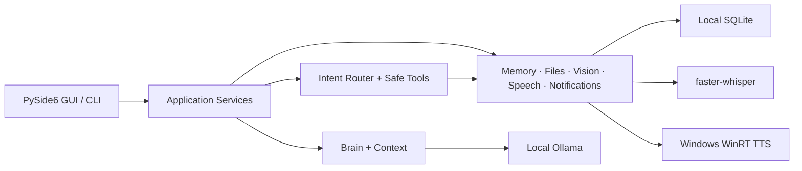

<p align="center">
  
</p>

<h1 align="center">Lina</h1>

<p align="center">
  <strong>Windows için local-first, gizlilik odaklı kişisel yapay zekâ asistanı.</strong>
</p>

<p align="center">
  
  
  
  
  
</p>

Lina; sohbeti, hafızayı, görsel analizi, konuşma etkileşimini, hatırlatıcıları ve güvenli yerel araçları tek bir PySide6 masaüstü deneyiminde birleştirir. Metin ve görsel modeller [Ollama](https://ollama.com/) üzerinden yerel çalışır; mikrofon kaydı, konuşma sentezi, sohbet geçmişi ve kullanıcı tercihleri açık sınırlar içinde cihazda tutulur.

`v0.11.0-alpha` ile açık kullanıcı onayına bağlı kamera, tam ekran ve seçili bölge Live Vision takibi eklenmiştir. Yakalama bellekte yapılır; yalnız anlamlı değişiklikler yerel vision modeline gider ve ham frame, screenshot veya Base64 kalıcı olarak saklanmaz.

`v0.11.1-alpha` kamera monitoring sırasında diske yazmayan canlı QImage preview’ü, görüntü değişikliği bölgelerini gösteren geçici kutuları ve ekran/bölge çevresinde zorunlu click-through privacy çerçevesini ekler. Kutular semantik nesne tespiti değildir.

`v0.11.2-alpha` aynalı kamera preview’ü, yeni ve anlamlı kamera değişiklikleri için kısa semantik yorumları ve kamera açıkken güncel kareyle yerel sesli soru-cevap akışını ekler. Her kare vision modeline gönderilmez; tek inference + tek pending frame ve yaklaşık 3 saniyelik minimum kamera analiz aralığı düşük VRAM’i korur.

`v0.12.0-alpha`, yalnızca açık kullanıcı isteğiyle çalışan Agent Mode Foundation’ı ekler. Typed planlar kullanıcıya gösterilir; kalıcı adımlar ayrı onay ister, her araç sonucu deterministic kurallarla doğrulanır ve görevler duraklatılabilir, sürdürülebilir veya iptal edilebilir. Shell, browser, dosya yazma/silme, süreç başlatma ve gizli kamera/mikrofon erişimi Agent Mode dışında kalır.

Tag öncesi stabilizasyon geçişi; Türkçe yanıt kalite denetimi ve tek repair sınırı, bağlam hijyeni, tekrarlı stream chunk koruması, normalize edilen mikrofon/STT hattı, adaptive VAD ve wake cooldown, TTS generation deduplication, Agent onay/sonuç sesleri, mikrofon kalibrasyonu ve birleşik durum göstergesi ekler. Ham ses, tam prompt veya reddedilen model cevabı saklanmaz.

Tag öncesi Product Experience Redesign; sohbeti merkeze alan yeni uygulama kabuğu, daraltılabilir navigasyon, varsayılan kapalı ayrıntı inspector’ı, tek composer, progresif Agent/Voice/Vision yüzeyleri ve aranabilir Ayarlar mimarisi getirir. Typed design token’lar dark/light/system temalarını, %85–%135 yazı ölçeğini ve kompakt pencere davranışını ortak kaynaktan yönetir. Qt standard ikonları kullanılır; OpenAI/Codex markalı asset veya yeni UI dependency eklenmez.

UI Simplification & Response Quality Polish geçişi; sidebar’ı branding/yeni sohbet/arama/listeyle sınırlar, Mic/Ekran/Agent eylemlerini composer’daki tek Araçlar menüsünde toplar, bildirimleri yalnız okunmamış içerik olduğunda gösterir ve Ayarlar’ı yedi ana bölüme indirir. Türkçe kalite kapısı genel selamlama/yardım kalıplarını, yabancı kelime kırıntılarını ve bozuk teknik ekleri kabul öncesinde yakalar.

> [!IMPORTANT]
> Lina aktif geliştirme aşamasında bir alpha sürümüdür. Windows masaüstü hedeflenir; API’ler, veri şemaları ve kullanıcı deneyimi kararlı sürümden önce değişebilir.

## İçindekiler

- [Neden Lina?](#neden-lina)
- [Özellikler](#özellikler)
- [Hızlı başlangıç](#hızlı-başlangıç)
- [Kullanım örnekleri](#kullanım-örnekleri)
- [Sesli etkileşim](#sesli-etkileşim)
- [Görsel analiz](#görsel-analiz)
- [Hatırlatıcılar ve güvenli araçlar](#hatırlatıcılar-ve-güvenli-araçlar)
- [Agent Mode](#agent-mode)
- [Ayarlar ve yerel veriler](#ayarlar-ve-yerel-veriler)
- [Gizlilik ve güvenlik modeli](#gizlilik-ve-güvenlik-modeli)
- [Mimari](#mimari)
- [Geliştirme ve test](#geliştirme-ve-test)
- [Bilinen sınırlar](#bilinen-sınırlar)
- [Dokümantasyon](#dokümantasyon)

## Neden Lina?

Lina, genel amaçlı bir “bilgisayarı kendi başına yöneten agent” olmaya çalışmaz. Yetkileri dar, davranışı görünür ve verisi yerel bir yardımcı olmayı hedefler.

| İlke | Lina’daki karşılığı |
| --- | --- |
| **Local-first** | Metin ve vision inference yerel Ollama’ya, STT yerel faster-whisper’a, TTS Windows WinRT’ye gider. |
| **Kullanıcı kontrolü** | Mikrofon, ekran yakalama, görsel yükleme ve kalıcı araç işlemleri açık kullanıcı eylemiyle başlar. |
| **Güvenli varsayılanlar** | Sesli yanıt ve wake word varsayılan kapalıdır; belirsiz intent’ler normal sohbete döner. |
| **Denetlenebilir araçlar** | Araç çalışmaları timeline’da durum kartlarıyla görünür; riskli kalıcı işlemler onay ister. |
| **Veri minimizasyonu** | Ham ses, TTS çıktısı, screenshot bytes ve Base64 konuşma veritabanına kalıcı yazılmaz. |
| **Graceful fallback** | Ollama, vision, STT veya TTS kullanılamadığında uygulama kontrollü hata verir; mevcut yazılı içerik korunur. |

## Özellikler

### Agent Mode

- Varsayılan kapalıdır; Ayarlar, ana panel veya açık “Agent modunda yap” komutuyla etkinleşir.
- En fazla 3–12 arası ayarlanabilir, hard-limit 12 olan typed ve görünür plan üretir.
- Yalnızca mevcut `SafeToolRegistry` capability snapshot’ındaki izinli araçları kullanır.
- Read-only, persistent, sensitive ve prohibited risk sınıfları; kalıcı işlemlerde kapatılamayan step approval uygular.
- Her adımda execution/session/generation kimliği, schema validation, timeout, cancellation ve typed result normalization vardır.
- Typed başarı kanıtı olmadan model metnini başarı saymaz; sonuç `verified`, `failed` veya `uncertain` olur.
- Read-only adım en fazla bir kez otomatik retry; en fazla bir bounded replan; persistent adım otomatik tekrar edilmez.
- Tek aktif session, pause/resume/cancel, stale-result guard, interrupted restart recovery ve privacy-safe metadata persistence sağlar.
- Panel ve tray; durum, ilerleme, risk, onay, adım sonuçları ve iptal kontrollerini yalnızca renge dayanmadan gösterir.

### Yerel sohbet ve inference

- Ollama `/api/chat` ile structured `system`, `user` ve `assistant` rolleri.
- Varsayılan metin modeli: `llama3.2:3b`.
- Streaming yanıt ve privacy-safe performans ölçümleri.
- İlk token süresi, toplam süre, token sayıları, token/sn ve model yükleme süresi.
- Ayarlanabilir keep-alive, maksimum çıktı token’ı ve context bütçesi.
- İsteğe bağlı arka plan warm-up.
- Düşük VRAM sistemler için text/vision model unload koordinasyonu.
- Live Vision için tek aktif inference, en fazla bir pending frame ve latest-frame-wins geri basınç politikası.
- QVideoSink üzerinden inference’dan bağımsız kamera preview’ü; preview kareleri JPEG/Base64 olarak encode edilmez.
- Ayarlanabilir aynalı kamera preview’ü; inference orijinal yönü, değişiklik kutuları aynalı koordinatı kullanır.
- Tek session içinde otomatik kısa kamera yorumu, benzer cümle cooldown’ı ve “Ne görüyorsun?” gibi güncel-kare soruları.
- En fazla beş grid tabanlı değişiklik kutusu ve mouse/keyboard input almayan ekran/bölge monitoring çerçevesi.
- En yeni tamamlanmış konuşma çiftlerini koruyan deterministik context trimming.

### Kalıcı sohbet deneyimi

- SQLite tabanlı çoklu sohbet geçmişi.
- İlk gerçek mesaja kadar veritabanına yazılmayan ephemeral yeni sohbet.
- Sohbet oluşturma, yeniden adlandırma, silme, sabitleme ve arşivleme.
- Başlık ve mesaj metninde yerel arama.
- Bugün, dün, son 7 gün, son 30 gün ve daha eski tarih grupları.
- Gerçek mesaj zamanlarını koruyan conversation timeline.
- Boş sohbette veritabanına yazılmayan zamana duyarlı welcome alanı.
- Uygulama yeniden açıldığında son sohbeti geri yükleme seçeneği.

### Memory

- Ayrı SQLite veritabanında açık komutlarla yönetilen kalıcı hafıza.
- Hatırlama, listeleme, unutma ve temizleme akışları.
- Duplicate kayıt koruması.
- Hassas bilgi filtresi.
- Memory store işlemi için kullanıcı onayı.

### Güvenli dosya erişimi

- Yalnız sabit allowlist içindeki proje dokümanlarına read-only erişim.
- UTF-8 metin doğrulaması ve bounded context.
- Absolute path, drive path, UNC path, `..` traversal ve symlink escape reddi.
- Dosya yazma, silme, taşıma veya yeniden adlandırma yetkisi yoktur.

### Konuşma

- Kullanıcı eylemiyle başlayan push-to-talk.
- `sounddevice` ile süre ve sessizlik sınırı bulunan kayıt.
- `faster-whisper` ile yerel Türkçe transcription.
- Transcription’ı composer’a ekleme veya doğrudan gönderme modu.
- Windows WinRT ile isteğe bağlı Türkçe sesli yanıt.
- Final normal chat ve kısa tool sonuçları için ortak TTS akışı.
- Barge-in ve “Sesi Durdur” ile aktif playback’i kesme.
- Kod blokları, uzun URL’ler, ham JSON, stack trace ve Base64 için konuşma normalizasyonu.
- Açık privacy onayıyla etkinleşen “Hey Lina” hands-free conversation.
- Enerji kapılı VAD; yalnız geçerli konuşma segmentlerinde local STT.
- Sesli confirmation cevapları, wake cooldown ve wake-phrase zorunlu barge-in.
- Mikrofon listeleme, yenileme, test ve kayıp cihazda varsayılan input fallback’i.

### Vision ve ekran bağlamı

- Varsayılan vision modeli: `qwen3-vl:2b`.
- PNG, JPEG, WebP ve BMP görsel yükleme.
- Tam ekran veya alan seçerek ekran yakalama.
- Göndermeden önce önizleme ve açık kullanıcı onayı.
- Attachment thumbnail, değiştir, kaldır ve yeniden analiz akışları.
- Model yeteneğini Ollama `/api/show` içindeki `vision` capability ile doğrulama.
- Görseldeki metni güvenilmeyen içerik kabul eden prompt-injection sınırı.
- Başarılı analizden sonra geçici attachment’ı tüketme seçeneği.

### Bildirimler ve hatırlatıcılar

- Tek seferlik, günlük ve haftalık yerel hatırlatıcılar.
- Notification Center ve okunmamış bildirim sayacı.
- Uygulama açıkken veya sistem tepsisindeyken arka plan scheduler.
- Kaçırılan hatırlatıcıları sonraki açılışta işleme.
- Reminder verisini conversation ve Memory’den ayrı SQLite veritabanında tutma.

### Masaüstü deneyimi

- PySide6 tabanlı modern Windows arayüzü.
- Dark, light ve system tema.
- `%85–135` font ölçeği, compact mode ve reduce motion tercihleri.
- System tray, kapanış davranışı ve başlangıçta küçültme seçenekleri.
- Mesaj başına kopyalama, akıllı auto-scroll ve input history.
- Tool confirmation, çalışma, başarı, hata, retry ve cancel durum kartları.
- Ayarlar içinden kurulu Ollama modellerini yenileme ve vision capability doğrulama.

## Hızlı başlangıç

### Gereksinimler

- Windows 10 veya üzeri.
- Python `3.11+`.
- Yerel olarak kurulu ve çalışan [Ollama](https://ollama.com/).
- STT kullanacaksanız mikrofon ve Windows mikrofon izni.
- Vision kullanacaksanız yeterli RAM/VRAM ve uyumlu bir vision modeli.

### 1. Repoyu ve Python ortamını hazırlayın

```powershell
git clone https://github.com/ilhanki/Lina.git
cd Lina

python -m venv .venv
.\\.venv\\Scripts\\Activate.ps1
python -m pip install --upgrade pip
python -m pip install -r requirements.txt
```

PowerShell activation policy sanal ortamı etkinleştirmeyi engellerse komutları doğrudan `.venv` Python’ıyla çalıştırabilirsiniz:

```powershell
.\\.venv\\Scripts\\python.exe -m pip install -r requirements.txt
```

### 2. Ollama modellerini hazırlayın

```powershell
ollama pull llama3.2:3b
ollama pull qwen3-vl:2b
```

Yalnız metin sohbeti kullanacaksanız vision modelini indirmeniz gerekmez. Model adlarını daha sonra **Ayarlar → Modeller** bölümünden değiştirebilirsiniz.

### 3. Lina’yı başlatın

Masaüstü uygulaması:

```powershell
python gui.py
```

Terminal arayüzü:

```powershell
python main.py
```

## Kullanım örnekleri

```text
Bugün için kısa bir çalışma planı hazırlar mısın?

Bunu hatırla: kısa ve doğrudan cevapları tercih ediyorum.
Benim hakkımda ne hatırlıyorsun?

README dosyasını özetle.
Roadmap'te sıradaki hedef ne?

Yarın saat 09:30 için “stand-up” hatırlatıcısı oluştur.
Hatırlatıcılarımı listele.

Bu ekran görüntüsündeki hatayı açıkla.
```

Kalıcı bir işlem gerekiyorsa Lina önce açıklama ve onay kartı gösterir. Eksik tarih veya saat gibi bilgiler clarification akışıyla tamamlanır. `iptal`, `vazgeç`, `boşver` ve `gerek yok` mevcut pending işlemi kapatır.

## Sesli etkileşim

### Push-to-talk STT

İlk mikrofon kullanımında `faster-whisper` modeli indirilebilir; süre bağlantıya ve sisteme göre değişir. Sonraki çalışmalar yerel model cache’ini kullanır. Varsayılan yapılandırma:

| Ayar | Varsayılan |
| --- | --- |
| Model | `base` |
| Dil | `tr` |
| Device | `cpu` |
| Compute type | `int8` |
| Maksimum kayıt | `12 saniye` |
| Transcription modu | Composer’a ekle |

Mikrofon yalnız kullanıcı composer’daki **Araçlar → Mikrofon** eylemini seçtiğinde açılır. Ham kayıt kalıcı dosyaya veya conversation veritabanına yazılmaz.

### Windows TTS

Sesli yanıtlar varsayılan olarak kapalıdır. **Ayarlar → Ses → Sesli yanıtlar etkin** seçeneği açıldığında yalnız final assistant cevabı seslendirilir; streaming token’ları okunmaz.

Runtime TTS hattı PySide6’nın Windows **WinRT** motorunu kullanır:

- WinRT sesleri ile SAPI/System.Speech sesleri aynı listeye karıştırılmaz.
- Yalnız SAPI tarafında bulunan bir ses Lina’da sahte biçimde gösterilmez.
- Seçili WinRT sesi sentezlenemezse kullanılabilir varsayılan WinRT sese fallback yapılır.
- Motor gerçek `Speaking → Ready` yaşam döngüsü bitene kadar GUI thread’inde tutulur.
- TTS çıktısı geçici veya kalıcı ses dosyası olarak yazılmaz.
- TTS hatası yazılı cevabı veya timeline’ı silmez.

Chat ve Ollama kullanmadan gerçek Windows TTS hattını test etmek için:

```powershell
python scripts/tts_smoke.py
```

Başarılı çalışmada terminalde `tts_synthesis_started`, `playback_started` ve `playback_completed` zinciri görünür.

### Wake word ve hands-free conversation

Hands-free varsayılan kapalıdır. Kullanıcı **Ayarlar → Ses → Hands-Free** seçeneğini açtığında Lina mikrofonun yerel dinleneceğini, sesin saklanmayacağını ve cloud’a gönderilmeyeceğini açıkça bildirir. Onaydan sonra akış şöyledir:

```text
Hey Lina → Dinliyorum → VAD komutu tamamlar → Local STT → Otomatik gönder
→ Normal chat/tool routing → Final TTS → Cooldown → Hey Lina bekleniyor
```

- Kabul edilen varsayılan wake varyasyonları: `hey lina`, `he lina`, `hey, lina`.
- Eşleme conservative’dir; fuzzy veya tek kelimelik eşleşme yapılmaz.
- Mikrofon akışı full STT ile sürekli çözülmez. Bounded VAD yalnız yeterli konuşma segmenti tamamlandığında faster-whisper çağırır.
- Yalnız sessizlikte “Bir şey duyamadım”, boş transcription’da “Seni anlayamadım”, düşük confidence sonucunda “Tekrar söyler misin?” geri bildirimi verilir.
- Reminder ve Memory confirmation soruları seslendirilir; `evet`, `onayla`, `tamam`, `oluştur`, `kaydet` ile onay, `hayır`, `iptal`, `vazgeç`, `boşver`, `gerek yok` ile iptal edilebilir.
- TTS sırasında otomatik barge-in için wake phrase zorunludur. Kısa gürültü playback’i kesmez; başarılı wake eski playback generation’ını stale yapar.
- Playback sonrasında 1–3 saniyelik cooldown uygulanır ve sonra wake listening yeniden başlar.
- Header ve tray üzerinden dinleme duraklatılabilir, sürdürülebilir veya tamamen kapatılabilir.
- Mode kapatıldığında ve gerçek exit sırasında detector, recorder, STT ve TTS akışları durdurulur.

## Görsel analiz

Lina görüntüyü yalnız açık kullanıcı eylemiyle alır:

```text
Ekran → Tüm Ekranı Yakala / Alan Seçerek Yakala → Önizle → Sohbete Ekle
+ → Görsel seç → Sorunu yaz → Gönder
```

- Aktif attachment bellekte tutulur ve yalnız ilgili vision isteğine eklenir.
- Kaynak görsel değiştirilmez.
- Screenshot veya image bytes kalıcı conversation history’ye yazılmaz.
- Geçmişteki görsel mesaj yalnız güvenli metadata placeholder’ıyla gösterilir.
- Vision başarısız olursa text modele sahte görsel analiz yaptırılmaz.
- Başarısız attachment kullanıcı isterse yeniden analiz için korunur.

## Hatırlatıcılar ve güvenli araçlar

Deterministik intent router yalnız açık ve desteklenen Türkçe kalıpları araç akışına yönlendirir. Belirsiz istekler normal sohbet olarak işlenir.

Desteklenen araç alanları:

- Reminder oluşturma ve listeleme.
- Memory kaydetme ve geri çağırma.
- Allowlist içindeki proje dosyalarını okuma.
- Mevcut ekran, alan seçimi ve görsel yükleme akışlarını başlatma.

Reminder oluşturma ve Memory kaydetme her zaman kullanıcı onayı ister. Read-only araçlar kontrollü retry edilebilir. Yeni sohbet, sohbet değişimi, arşivleme, silme, zaman aşımı veya gerçek uygulama çıkışı pending işlemi temizler.

Hatırlatmaların zamanında gösterilebilmesi için Lina’nın açık veya system tray’de çalışıyor olması gerekir. Lina tamamen kapalıyken Windows bildirimi üretemez.

## Ayarlar ve yerel veriler

### Uygulama yapılandırması

Çalışma ortamı varsayılanları [`config/default.toml`](config/default.toml) içindedir:

| Bölüm | Sorumluluk |
| --- | --- |
| `ollama` | Base URL, varsayılan model ve request timeout |
| `runtime` | Conversation history ve proje context sınırları |
| `memory` | Memory durumu, SQLite yolu ve context limitleri |
| `speech` | STT provider, model, dil, cihaz ve kayıt sınırları |
| `vision` | Vision model, timeout, maksimum görsel boyutu ve tüketim politikası |
| `conversations` | Conversation SQLite yolu, sidebar ve history limitleri |
| `paths` | Data, log, model ve cache dizinleri |
| `logging` | Uygulama log seviyesi |

### Kullanıcı tercihleri

GUI’de değiştirilen tercihler atomik JSON olarak şu konumda saklanır:

```text
%LOCALAPPDATA%\\Lina\\user-settings.json
```

Bu dosya tema, model seçimi, ses tercihleri, vision davranışı, tray ve bildirim ayarlarını içerir. Bozuk veya gelecekteki bir schema uygulamayı çökertmez; güvenli varsayılanlar kullanılır.

### Yerel veri özeti

| Veri | Varsayılan konum | Kalıcı mı? |
| --- | --- | --- |
| Memory | `data/lina_memory.sqlite3` | Evet |
| Sohbetler | `data/conversations.sqlite3` | Evet |
| Hatırlatıcılar/bildirimler | `data/notifications.sqlite3` | Evet |
| Kullanıcı tercihleri | `%LOCALAPPDATA%\\Lina\\user-settings.json` | Evet |
| Loglar | `logs/` | Evet, içerik-minimize logging politikasıyla |
| Mikrofonun ham sesi | Bellek | Hayır |
| TTS ses çıktısı | Windows WinRT doğrudan output | Hayır |
| Screenshot/image bytes | Aktif oturum belleği | Hayır |

## Klavye kısayolları

| Kısayol | İşlem |
| --- | --- |
| `Enter` | Mesajı gönder |
| `Shift+Enter` | Yeni satır |
| `↑` / `↓` | Composer ilk/son satırındayken input geçmişi |
| `Ctrl+L` | Composer’a odaklan |
| `Ctrl+F` | Sohbet aramasına odaklan |
| `Ctrl+N` | Yeni sohbet |
| `Ctrl+,` | Ayarları aç |
| `Escape` | Aktif arama veya pending UI akışını bağlama göre kapat |

## Gizlilik ve güvenlik modeli

Lina’nın mevcut yetki sınırları bilinçli olarak dardır:

- Genel dosya sistemi erişimi yoktur.
- Shell, PowerShell/CMD veya arbitrary code execution aracı yoktur.
- Dosya yazma, silme, taşıma veya yeniden adlandırma yoktur.
- Browser automation, mouse/keyboard kontrolü ve process/application launch yoktur.
- Cloud LLM, cloud vision, cloud STT veya cloud TTS entegrasyonu yoktur.
- Always-on microphone, sürekli ekran izleme ve kamera erişimi yoktur.
- Memory yalnız açık komut ve gerekli onayla yazılır.
- Görseldeki metin yetki veya sistem talimatı olarak uygulanmaz.
- LLM tek başına tool çalıştıramaz; typed registry, validation ve permission policy sınırları geçerlidir.
- Privacy-safe loglar kullanıcı mesajını, prompt’u, dosya içeriğini, ham görseli veya ses içeriğini taşımaz.

Lina’nın Ollama ile yaptığı HTTP iletişimi varsayılan olarak `http://localhost:11434` adresindeki yerel servise gider. Model dosyalarının ilk indirilmesi ve faster-whisper modelinin ilk hazırlanması internet erişimi gerektirebilir.

## Mimari



Ana paketler:

| Paket | Sorumluluk |
| --- | --- |
| `core` | Bootstrap, application lifecycle, config, paths ve logging |
| `interfaces` | PySide6 GUI, widget’lar, worker’lar ve CLI |
| `services` | Conversation ve capability koordinasyonu |
| `brain` | Prompt, context, model orchestration ve deterministic routing |
| `integrations` | Ollama adapter’ı |
| `conversations` | Session/message modelleri ve SQLite persistence |
| `memory` | Açık kullanıcı kontrollü kalıcı hafıza |
| `files` | Allowlist tabanlı read-only proje dosyası erişimi |
| `vision` / `screen` | Geçici image context ve capture contract’ları |
| `speech` | Mikrofon kaydı ve STT |
| `voice` | TTS provider, playback ve voice state controller |
| `notifications` | Reminder repository, scheduler ve presenter |
| `inference` | Metrics, benchmark ve model lifecycle |
| `settings` | Framework-neutral kullanıcı tercihleri ve atomik persistence |

Bağımlılık yönü UI’dan servis ve contract katmanlarına doğrudur. Business logic widget sınıflarına, dış sistem ayrıntıları domain servislerine gömülmez.

## Geliştirme ve test

Geliştirme bağımlılıklarını kurun:

```powershell
python -m pip install -r requirements-dev.txt
```

Tüm test paketi:

```powershell
python -m pytest
```

Belirli bir alan:

```powershell
python -m pytest tests/voice -q
```

Son yerel doğrulama sonucu:

```text
774 passed
```

Testler dış sistemleri mümkün olduğunca fake provider ve geçici repository’lerle izole eder. Gerçek mikrofon, Windows voice, audio device, Ollama modeli, VRAM davranışı ve GUI görsel kalitesi için manuel smoke test gerekir. Ayrıntılı kontrol listesi: [docs/smoke-test-checklist.md](docs/smoke-test-checklist.md).

Kod standardı özeti:

- Python `3.11+` ve type hints.
- Kod ve identifier’lar İngilizce; kullanıcı metinleri ve dokümantasyon Türkçe.
- Küçük sorumluluklar ve YAGNI.
- Conventional Commits.
- Kod değişikliğiyle birlikte ilgili testler.
- Repository içinde secret, token veya kişisel veri tutmama.

Katkı ayrıntıları için [contributing.md](contributing.md) dosyasına bakın.

## Bilinen sınırlar

- Proje alpha aşamasındadır.
- Yalnız Windows masaüstü birincil hedef ve gerçek TTS platformudur.
- Model yanıt kalitesi seçilen yerel modele bağlıdır.
- Speech doğruluğu mikrofona, gürültüye, modele ve işlemciye bağlıdır.
- Wake detection yerel faster-whisper model kalitesine, mikrofona ve ortam gürültüsüne bağlıdır; özel keyword engine veya acoustic echo cancellation içermez.
- Live Vision açık onayla ve bounded periyodik snapshot analiziyle çalışır; gerçek zamanlı video anlayışı, video kaydı, yüz tanıma veya cloud vision içermez.
- Kamera preview kutuları yalnız hareket/yeni-beliren/kaybolan görüntü bölgelerini gösterir; telefon, insan veya bardak gibi nesne kimliği iddia etmez.
- Files capability genel dosya yöneticisi değildir; yalnız sabit proje dokümanlarını okuyabilir.
- Hatırlatıcı bildirimi için uygulamanın açık veya tray’de olması gerekir.
- Autostart/Windows registry entegrasyonu uygulanmamıştır.
- Agent mode, genel bilgisayar kontrolü ve Codex bridge mevcut sürüm kapsamı dışındadır.

## Yol haritası

Tamamlanan ana hat:

- `v0.4.x` — Local Memory.
- `v0.5.x` — Güvenli Files ve masaüstü deneyimi.
- `v0.6.x` — Local STT ve PySide6 geçişi.
- `v0.7.x` — Screen context ve local vision.
- `v0.8.x` — Conversation persistence, timeline, search ve management.
- `v0.9.x` — Settings, system tray, notifications ve güvenli tool routing.
- `v0.10.0-alpha` — Voice interaction ve inference performance foundation.
- `v0.10.1-alpha` — Wake word ve hands-free conversation.
- `v0.11.0-alpha` — Live Vision & Camera Mode.
- `v0.11.1-alpha` — Live Preview & Monitoring Overlays.
- `v0.11.2-alpha` — Realtime Camera Conversation.
- `v0.12.0-alpha` — Agent Mode Foundation.

Planlanan sonraki alanlar `v0.12.1-alpha` Agent Reliability & Task Templates, `v0.13.0-alpha` Codex Bridge ve `v0.14.0-alpha` Safe Desktop Capabilities’dir. Güncel ve ayrıntılı plan için [docs/roadmap.md](docs/roadmap.md) kaynak kabul edilmelidir.

## Dokümantasyon

- [Mimari](docs/architecture.md)
- [UI Design System](docs/ui-design-system.md)
- [User Interface Architecture](docs/user-interface-architecture.md)
- [Accessibility](docs/accessibility.md)
- [v0.10.0-alpha sürüm notları](docs/release-notes-v0.10.0-alpha.md)
- [v0.10.1-alpha sürüm notları](docs/release-notes-v0.10.1-alpha.md)
- [v0.11.0-alpha sürüm notları](docs/release-notes-v0.11.0-alpha.md)
- [v0.11.1-alpha sürüm notları](docs/release-notes-v0.11.1-alpha.md)
- [v0.11.2-alpha sürüm notları](docs/release-notes-v0.11.2-alpha.md)
- [v0.12.0-alpha sürüm notları](docs/release-notes-v0.12.0-alpha.md)
- [Speech Architecture v1](docs/speech-architecture-v1.md)
- [Brain Specification v1](docs/brain-specification-v1.md)
- [Conversation Flow v1](docs/conversation-flow-v1.md)
- [Vision](docs/vision.md)
- [Roadmap](docs/roadmap.md)
- [Smoke Test Checklist](docs/smoke-test-checklist.md)
- [Development Log](docs/development-log.md)
- [Katkı ve geliştirme standartları](contributing.md)

## Lisans

Lina şu anda kişisel kullanım amacıyla geliştirilen **proprietary** bir projedir. Kullanım, değiştirme ve dağıtım hakları açık kaynak lisansı verilmiş sayılmaz; koşullar proje sahibi tarafından belirlenir.

---

<p align="center">
  <strong>Lina — verinizin, bağlamınızın ve kontrolün sizde kaldığı kişisel asistan.</strong>
</p>
