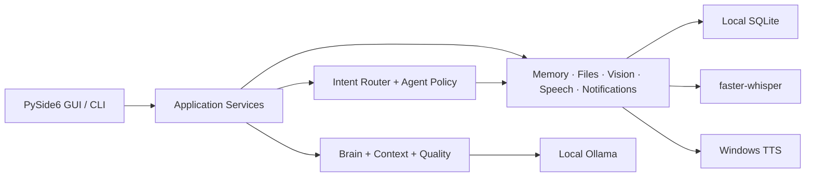

<p align="center">
  
</p>

<h1 align="center">Lina</h1>

<p align="center">
  <strong>Windows için local-first, gizlilik odaklı kişisel yapay zekâ asistanı.</strong>
</p>

<p align="center">
  
  
  
  
  
</p>

Lina; yerel sohbet, kalıcı hafıza, sesli etkileşim, görsel analiz, hatırlatıcılar ve kullanıcı onaylı Agent görevlerini tek bir PySide6 masaüstü uygulamasında birleştirir. Metin ve vision inference [Ollama](https://ollama.com/) üzerinden, konuşmayı yazıya çevirme `faster-whisper` ile, sesli yanıt ise Windows üzerinde yerel çalışır.

> [!IMPORTANT]
> Lina aktif geliştirme aşamasında bir **alpha** sürümüdür. Birincil hedef Windows masaüstüdür; arayüz, veri şemaları ve uygulama sözleşmeleri kararlı sürümden önce değişebilir.

## Öne çıkanlar

| Alan | Lina’nın yaklaşımı |
| --- | --- |
| **Yerel yapay zekâ** | Metin ve görsel modeller varsayılan olarak cihazınızdaki Ollama servisini kullanır. |
| **Görünür kullanıcı kontrolü** | Mikrofon, kamera, ekran yakalama ve kalıcı işlemler açık kullanıcı eylemiyle başlar. |
| **Güvenli Agent Mode** | Typed plan, risk sınıflandırması, adım onayı, doğrulanmış sonuç ve kontrollü recovery sunar. |
| **Veri minimizasyonu** | Ham ses, TTS çıktısı, screenshot bytes, Base64 ve model reasoning’i kalıcı geçmişe yazılmaz. |
| **Premium masaüstü deneyimi** | Responsive üç kolon, conversation sidebar, contextual inspector ve dark/light/system temaları vardır. |
| **Denetlenebilir kalite** | Türkçe yanıtlar persistence ve TTS öncesinde doğrulanır; en fazla bir güvenli repair uygulanır. |

## İçindekiler

- [Ürün deneyimi](#ürün-deneyimi)
- [Yetenekler](#yetenekler)
- [Hızlı başlangıç](#hızlı-başlangıç)
- [Kullanım örnekleri](#kullanım-örnekleri)
- [Ayarlar](#ayarlar)
- [Gizlilik ve güvenlik](#gizlilik-ve-güvenlik)
- [Yerel veriler](#yerel-veriler)
- [Mimari](#mimari)
- [Geliştirme](#geliştirme)
- [Bilinen sınırlar](#bilinen-sınırlar)
- [Yol haritası](#yol-haritası)
- [Dokümantasyon](#dokümantasyon)

## Ürün deneyimi

`v0.13.0-alpha`, premium arayüzü korurken güvenli Codex Bridge temelini sunar:

- Typed session, task, project context, event, result ve verification modelleri.
- Açık workspace seçimi; one-time varsayılan izin ve secret/path filtreleme.
- Her görevde plan onayı, modification işlerinde zorunlu işlem onayı.
- Ham çıktıyı göstermeyen kısa Lina mesajları ve metadata-only geçmiş.
- Tools inspector, command palette, sesli confirmation ve kapatılamayan güvenlik ayarları.

Önceki `v0.12.2-alpha` arayüz kazanımları korunur:

- Geniş pencerelerde **sidebar + conversation workspace + contextual inspector** düzeni.
- Orta genişlikte sağ drawer; kompakt görünümde icon sidebar ve overlay drawer.
- Son mesaj önizlemesi, tarih grupları, arama, sabitleme ve arşivleme içeren conversation navigation.
- Güvenli Markdown/code gösterimi, streaming ve mesaj eylemleri içeren assistant kartları.
- Dosya, mikrofon, ekran ve ek araçları birleştiren multiline composer.
- Gerçek Chat, Voice, Vision, File, Agent ve Memory sinyallerine bağlı sağ araç paneli.
- Dark, light ve system tema; yazı ölçeği, density ve kalıcı pencere tercihleri.
- Sol sidebar’ın alt bölümünde sürekli erişilebilir **Ayarlar** düğmesi.

Arayüzde sahte kullanıcı hesabı, ücretli plan, cloud hizmeti veya depolama kotası gösterilmez. Bir capability kullanılamıyorsa bunun yerine açık bir unavailable/empty state sunulur.

## Yetenekler

### Yerel sohbet ve conversation history

- Ollama `/api/chat` ile structured `system`, `user` ve `assistant` rolleri.
- Streaming yanıtlar ve privacy-safe inference metrikleri.
- SQLite tabanlı çoklu sohbet geçmişi.
- Sohbet oluşturma, yeniden adlandırma, silme, sabitleme ve arşivleme.
- Başlık ve mesaj metninde debounce edilen yerel arama.
- İlk gerçek mesaja kadar persistence oluşturmayan ephemeral yeni sohbet.
- Response Quality V3 ve tek-atımlık Repair V3.

Varsayılan metin modeli `llama3.2:3b`’dir. Model ve runtime sınırları Ayarlar’dan değiştirilebilir.

### Agent Mode

Agent Mode varsayılan olarak kapalıdır ve yeni bir genel bilgisayar kontrol yetkisi vermez.

- Yalnız mevcut `SafeToolRegistry` capability snapshot’ındaki araçlarla typed plan üretir.
- Planı çalıştırmadan önce kullanıcıya gösterir ve düzenlenebilir plan farkını sunar.
- Read-only, persistent, sensitive ve prohibited risk sınıflarını ayrı değerlendirir.
- Kalıcı adımlarda kapatılamayan açık kullanıcı onayı uygular.
- Schema validation, timeout, cancellation, stale-result guard ve typed result normalization kullanır.
- Read-only transient hatalarda en fazla bir retry; kalıcı veya belirsiz sonuçlarda otomatik tekrar yoktur.
- Pause, resume, cancel, bounded replan ve interrupted restart recovery sağlar.
- Task Center V2’de aktif, onay bekleyen, duraklatılmış, yarım ve tamamlanan görevleri ayırır.
- Ham araç argümanlarını veya tool payload’larını görev geçmişinde saklamaz.

Ayrıntılı sözleşmeler için [Agent görev şablonları](docs/agent-task-templates.md) ve [Agent recovery](docs/agent-recovery.md) belgelerine bakın.

### Memory ve güvenli dosyalar

- Açık komutlarla hatırlama, listeleme, unutma ve temizleme.
- Duplicate kayıt ve hassas bilgi koruması.
- Memory yazma işlemi için kullanıcı onayı.
- Yalnız sabit allowlist içindeki proje dokümanlarına read-only erişim.
- Absolute path, UNC path, `..` traversal ve symlink escape reddi.
- Dosya yazma, silme, taşıma veya yeniden adlandırma yetkisi yoktur.

### Sesli etkileşim

- Kullanıcı eylemiyle başlayan push-to-talk.
- `sounddevice` ile bounded kayıt ve `faster-whisper` ile yerel transcription.
- Transcription’ı composer’a ekleme veya doğrudan gönderme tercihi.
- Windows üzerinde isteğe bağlı yerel TTS; streaming token’ları değil yalnız final cevap seslendirilir.
- Barge-in, “Sesi Durdur”, mikrofon test ve kalibrasyon akışları.
- Açık privacy onayıyla “Hey Lina” hands-free conversation.
- Wake phrase, VAD, cooldown ve generation deduplication korumaları.

Ham mikrofon kaydı ve TTS çıktısı diske yazılmaz. Hands-free varsayılan olarak kapalıdır.

### Vision ve ekran bağlamı

- PNG, JPEG, WebP ve BMP görsel yükleme.
- Tam ekran veya seçili bölge yakalama; göndermeden önce önizleme.
- Açık izinle kamera, screen/region monitoring ve Live Vision.
- Attachment önizleme, değiştirme, kaldırma ve yeniden analiz.
- Ollama `/api/show` üzerinden vision capability doğrulaması.
- Tek aktif inference, en fazla bir pending frame ve latest-frame-wins geri basınç politikası.
- Ham frame, screenshot veya Base64 persistence’ı olmadan session-local işleme.

Varsayılan vision modeli `qwen3-vl:2b`’dir. Live Vision gerçek zamanlı video kaydı veya nesne tanıma sistemi değildir.

### Hatırlatıcılar ve bildirimler

- Tek seferlik, günlük ve haftalık yerel hatırlatıcılar.
- Notification Center ve okunmamış bildirim durumu.
- Uygulama açıkken veya system tray’deyken çalışan scheduler.
- Kaçırılan hatırlatıcıları sonraki açılışta işleme.
- Conversation ve Memory’den ayrı SQLite persistence.

## Hızlı başlangıç

### Gereksinimler

- Windows 10 veya üzeri.
- Python `3.11+`.
- Kurulu ve çalışan [Ollama](https://ollama.com/).
- Speech için mikrofon ve Windows mikrofon izni.
- Vision için yeterli RAM/VRAM ve uyumlu bir model.

### Kurulum

```powershell
git clone https://github.com/ilhanki/Lina.git
cd Lina

python -m venv .venv
.\.venv\Scripts\Activate.ps1
python -m pip install --upgrade pip
python -m pip install -r requirements.txt
```

PowerShell activation policy sanal ortamı engelliyorsa doğrudan sanal ortam Python’ını kullanabilirsiniz:

```powershell
.\.venv\Scripts\python.exe -m pip install -r requirements.txt
```

### Modeller

```powershell
ollama pull llama3.2:3b
ollama pull qwen3-vl:2b
```

Yalnız metin sohbeti kullanacaksanız vision modelini indirmeniz gerekmez.

### Çalıştırma

Masaüstü uygulaması:

```powershell
python gui.py
```

Terminal arayüzü:

```powershell
python main.py
```

## Kullanım örnekleri

```text
Bugün için kısa bir çalışma planı hazırlar mısın?

Bunu hatırla: kısa ve doğrudan cevapları tercih ediyorum.
Benim hakkımda ne hatırlıyorsun?

README dosyasını özetle.
Roadmap’te sıradaki hedef ne?

Yarın saat 09:30 için “stand-up” hatırlatıcısı oluştur.
Bu ekran görüntüsündeki hatayı açıkla.
```

Kalıcı bir işlem gerekiyorsa Lina önce işlem ve risk özetini gösterir. Eksik tarih/saat gibi bilgiler clarification akışıyla tamamlanır. `iptal`, `vazgeç`, `boşver` ve `gerek yok` ifadeleri pending işlemi kapatır.

## Ayarlar

Ayarlar penceresine iki yoldan ulaşabilirsiniz:

- Sol sidebar’ın altındaki **Ayarlar** düğmesi.
- `Ctrl+,` klavye kısayolu.

Ana bölümler Genel, Görünüm, Modeller, Ses, Vision, Hatırlatıcılar ve Gelişmiş’tir. Agent, Gizlilik, Sistem ve tanılama seçenekleri Gelişmiş altında gruplanır.

| Alan | Örnek tercihler |
| --- | --- |
| Görünüm | Dark/light/system, font scale, density, sidebar, right panel ve mesaj genişliği |
| Modeller | Text/vision modeli, timeout, keep-alive, refresh ve benchmark |
| Ses | Input device, STT/TTS, kalibrasyon, hands-free, wake phrase ve barge-in |
| Vision | Görsel analiz, kamera, monitoring ve attachment davranışı |
| Agent | Agent Mode, adım sınırı, plan görünürlüğü, recovery ve history retention |
| Sistem | Tray, kapanış davranışı, başlangıç ve yerel çalışma tercihleri |

Kullanıcı tercihleri atomik JSON olarak `%LOCALAPPDATA%\Lina\user-settings.json` konumunda tutulur. Bozuk veya eski schema güvenli varsayılanlara migrate edilir.

### Klavye kısayolları

| Kısayol | İşlem |
| --- | --- |
| `Enter` | Mesajı gönder |
| `Shift+Enter` | Yeni satır |
| `↑` / `↓` | Composer input geçmişi |
| `Ctrl+L` | Composer’a odaklan |
| `Ctrl+F` | Sohbet araması |
| `Ctrl+N` | Yeni sohbet |
| `Ctrl+K` / `Ctrl+Shift+P` | Komut paleti |
| `Ctrl+,` | Ayarları aç |
| `Escape` | Aktif drawer, arama veya bağlamsal yüzeyi kapat |

## Gizlilik ve güvenlik

Lina’nın yetki sınırları bilinçli olarak dardır.

| Desteklenen | Desteklenmeyen |
| --- | --- |
| Yerel Ollama inference | Cloud LLM, cloud vision veya cloud speech |
| Kullanıcı eylemli mikrofon/kamera/ekran | Gizli veya izinsiz capture |
| Allowlist tabanlı read-only dosya okuma | Genel dosya sistemi veya dosya yazma/silme |
| Typed ve onaylı güvenli araçlar | Shell, PowerShell/CMD veya arbitrary code execution |
| Yerel Memory ve conversation persistence | Ham ses, screenshot bytes, Base64 veya model reasoning persistence’ı |
| Uygulama içi Agent planları | Browser automation, mouse/keyboard kontrolü veya process launch |

Ek korumalar:

- LLM tek başına tool çalıştıramaz; registry, schema ve permission policy uygulanır.
- Kalıcı araç işlemleri açık kullanıcı onayı ister.
- Görseldeki metin güvenilmeyen içeriktir; sistem talimatı veya yetki sayılmaz.
- Geçersiz model cevabı final assistant mesajı, persistence, notification veya TTS girdisi olmaz.
- Privacy-safe loglar prompt, kullanıcı mesajı, dosya içeriği, ham görsel veya ses taşımaz.

Ollama iletişimi varsayılan olarak `http://localhost:11434` adresindeki yerel servise gider. İlk model indirmeleri ve `faster-whisper` modelinin ilk hazırlanması internet erişimi gerektirebilir.

## Yerel veriler

| Veri | Varsayılan konum | Kalıcı mı? |
| --- | --- | --- |
| Memory | `data/lina_memory.sqlite3` | Evet |
| Sohbetler | `data/conversations.sqlite3` | Evet |
| Hatırlatıcılar ve bildirimler | `data/notifications.sqlite3` | Evet |
| Kullanıcı tercihleri | `%LOCALAPPDATA%\Lina\user-settings.json` | Evet |
| Loglar | `logs/` | Evet, içerik-minimize politikasıyla |
| Mikrofonun ham sesi | Bellek | Hayır |
| TTS ses çıktısı | Doğrudan Windows output | Hayır |
| Screenshot ve image bytes | Aktif oturum belleği | Hayır |

Çalışma ortamı varsayılanları [`config/default.toml`](config/default.toml) dosyasındadır.

## Mimari



| Paket | Sorumluluk |
| --- | --- |
| `core` | Bootstrap, lifecycle, config, paths ve logging |
| `interfaces` | PySide6 GUI, widget’lar, worker’lar ve CLI |
| `services` | Conversation ve capability koordinasyonu |
| `brain` / `quality` | Prompt, context, model orchestration ve yanıt doğrulama |
| `agent` | Typed planlama, policy, execution, task templates ve recovery |
| `conversations` / `memory` | Framework-neutral modeller ve SQLite persistence |
| `files` | Allowlist tabanlı read-only dosya erişimi |
| `vision` / `screen` | Geçici image context, capture ve Live Vision sözleşmeleri |
| `speech` / `voice` | Mikrofon, STT, TTS ve voice lifecycle |
| `notifications` | Reminder repository, scheduler ve presenter |
| `settings` | Typed kullanıcı tercihleri ve atomik persistence |
| `ui.design` | Semantic token, palette ve cache’li ikon sistemi |

UI, servis ve domain katmanlarından ayrıdır. Widget’lar capability kurallarını yeniden tanımlamaz; backend state typed servis/controller sözleşmelerinden gelir. Ayrıntılar için [mimari dokümanı](docs/architecture.md) kaynak kabul edilmelidir.

## Geliştirme

Geliştirme bağımlılıkları:

```powershell
python -m pip install -r requirements-dev.txt
```

Tam test paketi:

```powershell
python -m pytest -q
```

Compile kontrolü:

```powershell
python -m compileall -q src/lina
```

Son doğrulanan regresyon sonucu:

```text
1053 passed
```

Otomatik testler dış sistemleri fake provider ve geçici repository’lerle izole eder. Gerçek Ollama modeli, Windows mikrofon/TTS, kamera, DPI, multi-monitor ve GUI erişilebilirliği için [manuel smoke checklist](docs/smoke-test-checklist.md) uygulanmalıdır.

Geliştirme ilkeleri:

- Python `3.11+`, type hints ve küçük sorumluluklar.
- Kod ve identifier’larda İngilizce; kullanıcı metinleri ve dokümantasyonda Türkçe.
- Conventional Commits ve değişiklikle birlikte ilgili testler.
- Repository içinde secret, token veya kişisel veri tutmama.

Katkı kuralları için [contributing.md](contributing.md) dosyasına bakın.

## Bilinen sınırlar

- Proje alpha aşamasındadır ve Windows birincil hedeftir.
- Model yanıt kalitesi seçilen yerel modele ve donanıma bağlıdır.
- STT ve wake-word doğruluğu mikrofon, gürültü ve model kalitesinden etkilenir.
- Live Vision bounded snapshot analizi yapar; video kaydı, yüz tanıma veya semantic object detection değildir.
- Hatırlatıcı bildirimi için uygulamanın açık veya system tray’de olması gerekir.
- Autostart/Windows registry entegrasyonu henüz uygulanmamıştır.
- Codex Bridge ve genel bilgisayar kontrolü bu sürümün kapsamı dışındadır.

## Yol haritası

Tamamlanan son sürüm hattı:

- `v0.10.0-alpha` — Voice Interaction & Inference Performance Foundation.
- `v0.10.1-alpha` — Wake Word & Hands-Free Conversation.
- `v0.11.0-alpha` — Live Vision & Camera Mode.
- `v0.11.1-alpha` — Live Preview & Monitoring Overlays.
- `v0.11.2-alpha` — Realtime Camera Conversation.
- `v0.12.0-alpha` — Agent Mode Foundation.
- `v0.12.1-alpha` — Agent Reliability, Task Templates & Recovery.
- `v0.12.2-alpha` — Reference-Driven Premium Desktop Experience.
- `v0.13.0-alpha` — Codex Bridge Foundation.

Planlanan yön:

1. `v0.13.0-alpha` — Codex Bridge.
2. `v0.14.0-alpha` — Safe Desktop Capabilities.
3. `v0.15.0-alpha` — Packaging & Update Foundation.

Güncel plan için [roadmap](docs/roadmap.md) belgesine bakın.

## Dokümantasyon

| Belge | İçerik |
| --- | --- |
| [Mimari](docs/architecture.md) | Katmanlar, servisler ve güvenlik sınırları |
| [Referans UI uygulaması](docs/reference-ui-implementation.md) | v0.12.2 shell, responsive ve inspector kararları |
| [Codex Bridge](docs/codex-bridge.md) | Mimari, workspace, approval, events, voice ve güvenlik sınırları |
| [UI Design System](docs/ui-design-system.md) | Token, palette, tipografi ve ikon sistemi |
| [User Interface Architecture](docs/user-interface-architecture.md) | App shell, conversation ve progressive disclosure |
| [Accessibility](docs/accessibility.md) | Klavye, focus, status ve ekran okuyucu politikası |
| [Agent görev şablonları](docs/agent-task-templates.md) | Typed template ve capability sözleşmesi |
| [Agent recovery](docs/agent-recovery.md) | Retry, idempotency, checkpoint ve restart davranışı |
| [Speech Architecture](docs/speech-architecture-v1.md) | STT/TTS ve hands-free lifecycle |
| [Vision](docs/vision.md) | Image, capture, monitoring ve privacy modeli |
| [v0.12.2 sürüm notları](docs/release-notes-v0.12.2-alpha.md) | Sürüm kapsamı ve bilinen sınırlar |
| [v0.13.0 sürüm notları](docs/release-notes-v0.13.0-alpha.md) | Codex Bridge Foundation kapsamı ve doğrulama |
| [Smoke Test Checklist](docs/smoke-test-checklist.md) | Windows manuel doğrulama listesi |
| [Development Log](docs/development-log.md) | Kronolojik geliştirme kaydı |

## Lisans

Lina **proprietary** bir projedir. Açık kaynak lisansı verilmiş sayılmaz; kullanım, değiştirme ve dağıtım koşulları proje sahibi tarafından belirlenir.

---

<p align="center">
  <strong>Lina — verinizin, bağlamınızın ve kontrolün sizde kaldığı kişisel asistan.</strong>
</p>
